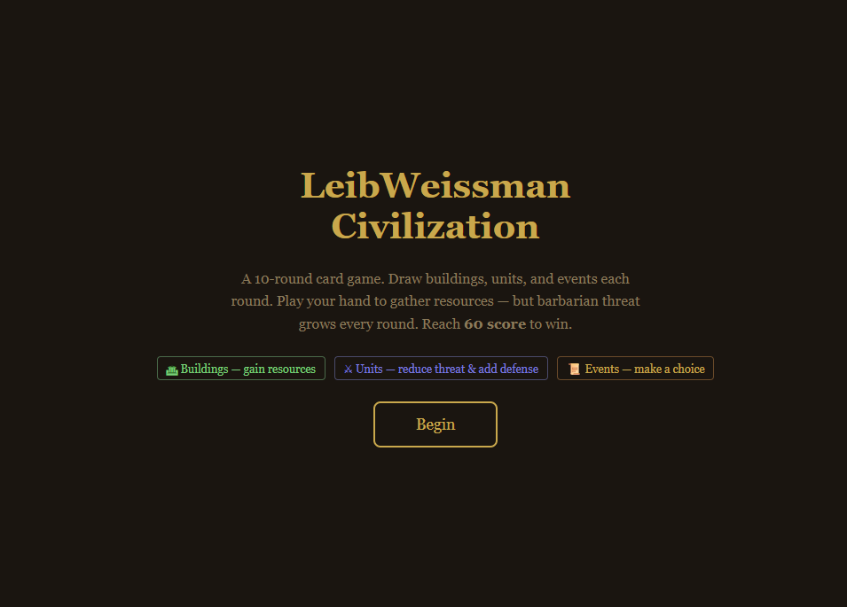
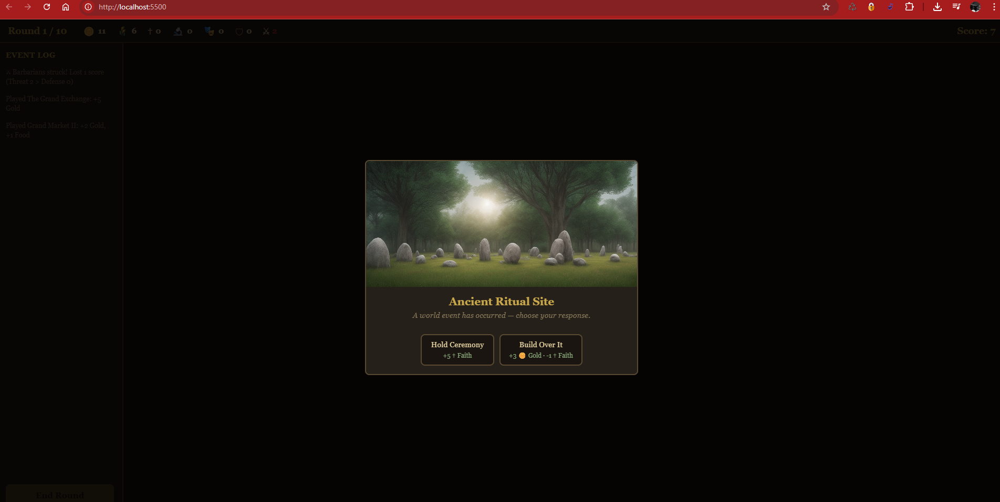
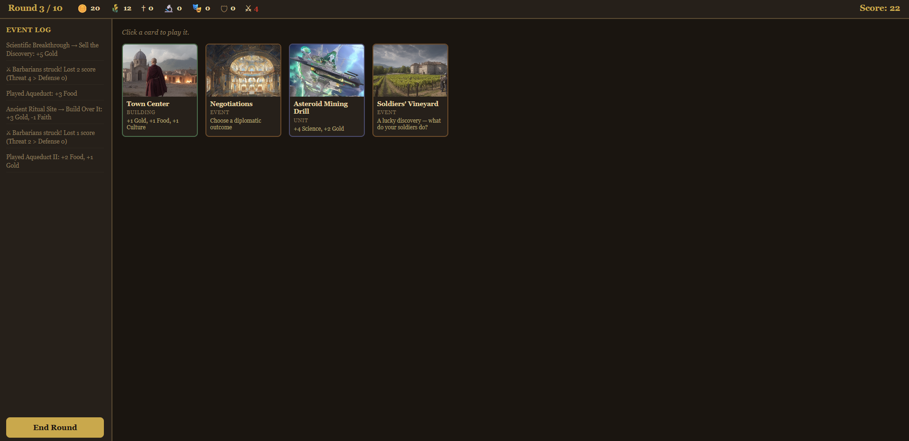

# LeibWeissman Civilization

A browser-based card game inspired by Civilization V. Build your empire over 10 rounds by playing buildings, units, and events — all while holding back the barbarian threat.



## Gameplay

Each round you draw a hand of 4 cards and play them to gather resources. Barbarian threat grows by 2 every round — let it outpace your defense and your score takes a hit. Reach **60 score** to win.

**Card types:**
- 🏛 **Buildings** — generate resources (gold, food, faith, science, culture)
- ⚔ **Units** — reduce threat and add defense
- 📜 **Events** — present a choice with tradeoffs





## How to Run

The game runs entirely in the browser — no build step or server required.

**Using VS Code + Live Server (recommended):**

1. Open the project folder in VS Code
2. Install the [Live Server](https://marketplace.visualstudio.com/items?itemName=ritwickdey.LiveServer) extension if you haven't already
3. Right-click `index.html` in the Explorer and select **"Open with Live Server"**
4. The game opens at `http://127.0.0.1:5500`

**Alternatively**, just open `index.html` directly in any modern browser.

## Project Structure

```
index.html   — game layout and UI
style.css    — styling
cards.js     — card definitions
game.js      — game logic and state management
v2/          — Civilization V mod assets (leader/civ icons)
```
